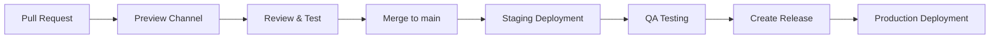

# Firebase Hosting Multi-Environment Setup

This document explains the multi-environment Firebase Hosting configuration with staging, production, and preview deployments.

## Table of Contents

- [Environment Overview](#environment-overview)
- [Configuration](#configuration)
- [Deployment Workflows](#deployment-workflows)
- [Manual Deployment](#manual-deployment)
- [Channel Management](#channel-management)
- [Custom Domains](#custom-domains)
- [Promoting Staging to Production](#promoting-staging-to-production)

---

## Environment Overview

### Environments

| Environment | URL | Deploy Trigger | Purpose |
|-------------|-----|----------------|---------|
| **Production** | https://dcmco-prod-2026.web.app | Release tags or manual | Live production site |
| **Staging** | https://dcmco-staging.web.app | Push to `main` | Testing before production |
| **Preview** | https://dcmco-prod-2026--pr-123-xxx.web.app | Pull requests | PR review and testing |

### Deployment Strategy



**Flow:**
1. Developer creates PR → Preview deployment created
2. PR merged to `main` → Staging deployment triggered
3. QA tests staging → Feedback loop
4. Create GitHub Release → Production deployment triggered

---

## Configuration

### .firebaserc

Defines project aliases and hosting targets:

```json
{
  "projects": {
    "default": "dcmco-prod-2026",
    "production": "dcmco-prod-2026",
    "staging": "dcmco-prod-2026"
  },
  "targets": {
    "dcmco-prod-2026": {
      "hosting": {
        "production": ["dcmco-prod-2026"],
        "staging": ["dcmco-staging"]
      }
    }
  }
}
```

**Key Concepts:**
- `projects`: Project aliases for different environments
- `targets.hosting`: Maps target names to Firebase Hosting site IDs
- Both production and staging use the same Firebase project

### firebase.json

Defines hosting configuration for each target:

```json
{
  "hosting": [
    {
      "target": "production",
      "public": "out",
      "cleanUrls": true,
      // ... headers and redirects
    },
    {
      "target": "staging",
      "public": "out",
      "cleanUrls": true,
      // ... same configuration as production
    }
  ]
}
```

**Why Array Format:**
- Each object represents a hosting target
- Configuration is shared between staging and production
- Allows future environment-specific settings

---

## Deployment Workflows

### Staging Deployment

**Workflow:** `.github/workflows/deploy-staging.yml`

**Triggers:**
- Push to `main` branch (automatic)
- Manual dispatch via GitHub UI

**Process:**
```yaml
on:
  push:
    branches:
      - main
  workflow_dispatch:
```

**Deploy Step:**
```yaml
- name: Deploy to Firebase Hosting (Staging)
  uses: FirebaseExtended/action-hosting-deploy@v0
  with:
    projectId: dcmco-prod-2026
    target: staging
```

**URL:** https://dcmco-staging.web.app

---

### Production Deployment

**Workflow:** `.github/workflows/deploy-production.yml`

**Triggers:**
- GitHub Release published (automatic)
- Manual dispatch with confirmation

**Confirmation Required:**
```yaml
on:
  release:
    types: [published]
  workflow_dispatch:
    inputs:
      confirm:
        description: 'Type "deploy" to confirm production deployment'
        required: true
```

**Deploy Step:**
```yaml
- name: Deploy to Firebase Hosting (Production)
  uses: FirebaseExtended/action-hosting-deploy@v0
  with:
    projectId: dcmco-prod-2026
    target: production
```

**URL:** https://dcmco-prod-2026.web.app

---

### Preview Deployments

**Workflow:** `.github/workflows/deploy-preview.yml`

**Triggers:**
- Pull request opened, synchronized, or reopened

**Process:**
```yaml
on:
  pull_request:
    types: [opened, synchronize, reopened]
```

**Deploy Step:**
```yaml
- name: Deploy to Firebase Hosting Preview Channel
  uses: FirebaseExtended/action-hosting-deploy@v0
  with:
    projectId: dcmco-prod-2026
    expires: 7d
```

**URL Format:** `https://dcmco-prod-2026--pr-<number>-<hash>.web.app`

**Features:**
- Unique URL per PR
- Automatically expires after 7 days
- PR comment with preview link
- No impact on staging/production

---

## Manual Deployment

### Prerequisites

```bash
# Install Firebase CLI
npm install -g firebase-tools

# Authenticate
firebase login

# Verify project access
firebase projects:list
```

### Deploy to Specific Environment

```bash
# Build the site
pnpm build

# Deploy to staging
firebase deploy --only hosting:staging --project dcmco-prod-2026

# Deploy to production
firebase deploy --only hosting:production --project dcmco-prod-2026

# Deploy to both
firebase deploy --only hosting --project dcmco-prod-2026
```

### Using Project Aliases

```bash
# Deploy to staging (using alias)
firebase use staging
firebase deploy --only hosting

# Deploy to production (using alias)
firebase use production
firebase deploy --only hosting

# Switch back to default
firebase use default
```

---

## Channel Management

### List Active Channels

```bash
# List all hosting sites
firebase hosting:sites:list --project dcmco-prod-2026

# List preview channels
firebase hosting:channel:list --project dcmco-prod-2026
```

### Create Preview Channel

```bash
# Create a preview channel
firebase hosting:channel:deploy feature-x --expires 7d --project dcmco-prod-2026

# Output:
# ✔  Deploy complete!
# ✔  Preview URL: https://dcmco-prod-2026--feature-x-abc123.web.app
```

### Delete Preview Channel

```bash
# Delete specific preview
firebase hosting:channel:delete pr-123 --project dcmco-prod-2026

# Channels auto-expire, so manual deletion is optional
```

### View Channel Details

```bash
# Get channel info
firebase hosting:channel:info pr-123 --project dcmco-prod-2026
```

---

## Custom Domains

### Future Setup

When custom domains are configured:

| Environment | Custom Domain |
|-------------|---------------|
| Production | www.dcmco.com.au |
| Staging | staging.dcmco.com.au |

### Configuration Steps

1. **Add domains in Firebase Console:**
   - Go to [Hosting Settings](https://console.firebase.google.com/project/dcmco-prod-2026/hosting)
   - Click "Add custom domain"
   - Follow DNS verification steps

2. **Production domain:**
   ```bash
   # Connect to production site
   firebase hosting:sites:get dcmco-prod-2026 --project dcmco-prod-2026

   # Add domain via Firebase Console:
   # Domain: www.dcmco.com.au
   # Site: dcmco-prod-2026
   ```

3. **Staging domain:**
   ```bash
   # Connect to staging site
   firebase hosting:sites:get dcmco-staging --project dcmco-prod-2026

   # Add domain via Firebase Console:
   # Domain: staging.dcmco.com.au
   # Site: dcmco-staging
   ```

4. **DNS Configuration:**
   ```
   # Add these DNS records:

   # Production (www.dcmco.com.au)
   A     www    151.101.1.195
   A     www    151.101.65.195

   # Staging (staging.dcmco.com.au)
   A     staging    151.101.1.195
   A     staging    151.101.65.195
   ```

5. **SSL Certificates:**
   - Firebase automatically provisions SSL certificates
   - HTTPS is enforced by default
   - Certificates auto-renew

---

## Promoting Staging to Production

### Method 1: Release-Based (Recommended)

This is the safest approach using Git tags:

```bash
# 1. Verify staging is working
curl -I https://dcmco-staging.web.app

# 2. Get the commit SHA from staging
gh run list --workflow=deploy-staging.yml --limit 1 --json headSha

# 3. Create a GitHub Release
gh release create v1.0.0 \
  --title "Release v1.0.0" \
  --notes "Production deployment of staging build" \
  --target <commit-sha>

# This automatically triggers production deployment
```

### Method 2: Manual Deployment

Deploy the same code that's on staging:

```bash
# 1. Checkout the commit that's on staging
git checkout <staging-commit-sha>

# 2. Build
pnpm build

# 3. Deploy to production
firebase deploy --only hosting:production --project dcmco-prod-2026

# 4. Return to main
git checkout main
```

### Method 3: GitHub Actions Manual Trigger

```bash
# 1. Go to Actions tab:
# https://github.com/shanefitzgerald/DCMCO-WEBSITE/actions/workflows/deploy-production.yml

# 2. Click "Run workflow"

# 3. Enter "deploy" as confirmation

# 4. Select the branch (usually main)

# 5. Click "Run workflow"
```

### Verification After Promotion

```bash
# 1. Check production is accessible
curl -I https://dcmco-prod-2026.web.app

# 2. Compare content hashes (staging vs production)
curl -s https://dcmco-staging.web.app/ | md5
curl -s https://dcmco-prod-2026.web.app/ | md5

# 3. Verify deployment in Firebase Console
# https://console.firebase.google.com/project/dcmco-prod-2026/hosting

# 4. Check deployment history
firebase hosting:releases:list --project dcmco-prod-2026
```

---

## Rollback

### Staging Rollback

```bash
firebase hosting:rollback dcmco-staging --project dcmco-prod-2026
```

### Production Rollback

```bash
firebase hosting:rollback dcmco-prod-2026 --project dcmco-prod-2026
```

### Rollback to Specific Version

```bash
# 1. List releases
firebase hosting:releases:list --project dcmco-prod-2026

# 2. Rollback to specific release
firebase hosting:rollback <release-id> --project dcmco-prod-2026
```

---

## Monitoring

### Firebase Console

- [Hosting Dashboard](https://console.firebase.google.com/project/dcmco-prod-2026/hosting)
- View deployment history
- Monitor usage and bandwidth
- Check active preview channels

### GitHub Actions

- [Staging Deployments](https://github.com/shanefitzgerald/DCMCO-WEBSITE/actions/workflows/deploy-staging.yml)
- [Production Deployments](https://github.com/shanefitzgerald/DCMCO-WEBSITE/actions/workflows/deploy-production.yml)
- [Preview Deployments](https://github.com/shanefitzgerald/DCMCO-WEBSITE/actions/workflows/deploy-preview.yml)

---

## Troubleshooting

### Target Not Found Error

**Error:** `Target staging not found in firebase.json`

**Solution:**
```bash
# Re-apply hosting targets
firebase target:apply hosting production dcmco-prod-2026 --project dcmco-prod-2026
firebase target:apply hosting staging dcmco-staging --project dcmco-prod-2026
```

### Site Does Not Exist

**Error:** `Site dcmco-staging does not exist`

**Solution:**
```bash
# Create the staging site
firebase hosting:sites:create dcmco-staging --project dcmco-prod-2026

# Apply target
firebase target:apply hosting staging dcmco-staging --project dcmco-prod-2026
```

### Wrong Site Deployed

If you deployed to the wrong environment:

```bash
# Immediately rollback the wrong deployment
firebase hosting:rollback <wrong-site> --project dcmco-prod-2026

# Deploy to correct environment
firebase deploy --only hosting:<correct-target> --project dcmco-prod-2026
```

---

## Best Practices

### 1. Always Test in Staging First

```bash
# Never deploy directly to production without staging testing
✅ PR → Preview → Merge → Staging → QA → Production
❌ PR → Merge → Production
```

### 2. Use Release Tags for Production

```bash
# Production deployments should always be tagged
git tag -a v1.0.0 -m "Release version 1.0.0"
git push origin v1.0.0

# Or create via GitHub Releases
```

### 3. Monitor After Production Deployment

```bash
# Check immediately after deployment
curl -I https://dcmco-prod-2026.web.app
# Check for errors in browser console
# Monitor Firebase Console for traffic/errors
```

### 4. Keep Environments in Sync

```bash
# Staging and production should use the same code
# Only difference should be the environment they're deployed to
```

### 5. Clean Up Preview Channels

```bash
# Previews auto-expire after 7 days
# But you can manually clean up after PR merge:
firebase hosting:channel:delete pr-123 --project dcmco-prod-2026
```

---

## Quick Reference

### URLs

```
Production:  https://dcmco-prod-2026.web.app
Staging:     https://dcmco-staging.web.app
Preview:     https://dcmco-prod-2026--pr-<number>-<hash>.web.app
```

### Deploy Commands

```bash
# Staging
firebase deploy --only hosting:staging --project dcmco-prod-2026

# Production
firebase deploy --only hosting:production --project dcmco-prod-2026

# Both
firebase deploy --only hosting --project dcmco-prod-2026
```

### Rollback Commands

```bash
# List releases
firebase hosting:releases:list --project dcmco-prod-2026

# Rollback staging
firebase hosting:rollback dcmco-staging --project dcmco-prod-2026

# Rollback production
firebase hosting:rollback dcmco-prod-2026 --project dcmco-prod-2026
```

---

## Additional Resources

- [Firebase Hosting Multi-site](https://firebase.google.com/docs/hosting/multisites)
- [Firebase Hosting Targets](https://firebase.google.com/docs/cli/targets)
- [Firebase Hosting Channels](https://firebase.google.com/docs/hosting/test-preview-deploy)
- [GitHub Actions Workflows](../.github/workflows/)
